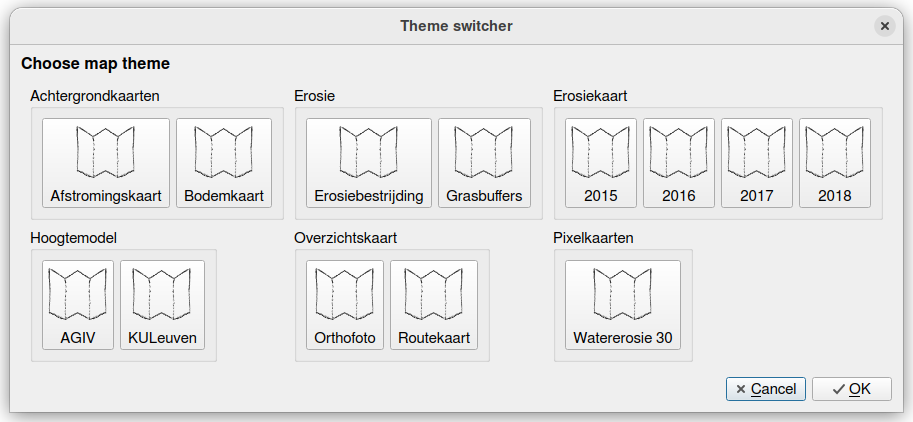

# QGIS theme switcher

A QGIS plugin to easily switch between map themes with a pop-up dialog.

## Guide

- Add the Theme Switcher toolbar.
- Click the button to open the dialog to switch between themes.

### Theme groups

Group themes into groups by prepending the theme name with the group name, separated with ':'

For example, themes 'Erosiekaart: 2015' and 'Erosiekaart: 2016' will be grouped in a group named 'Erosiekaart'.

## Preview

